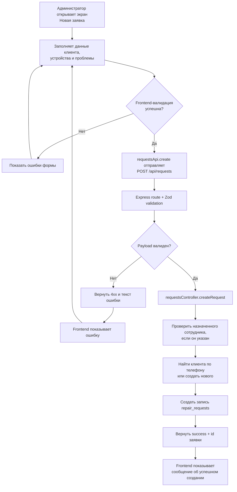
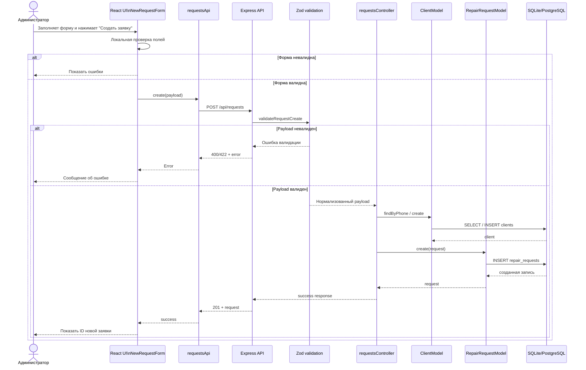
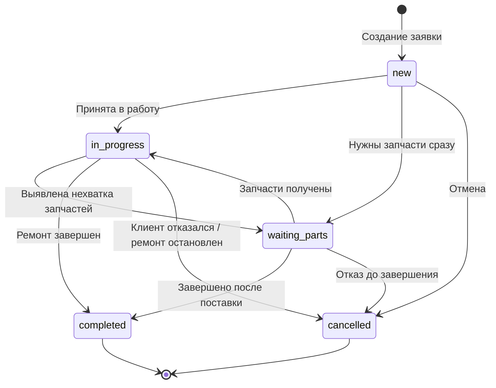
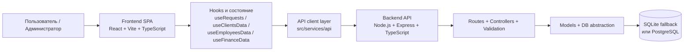
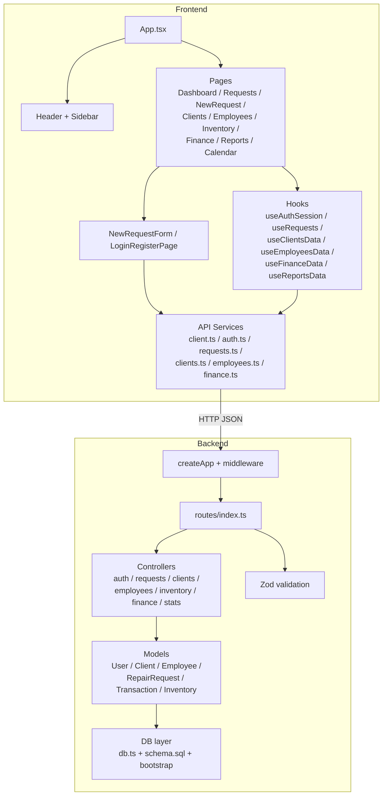
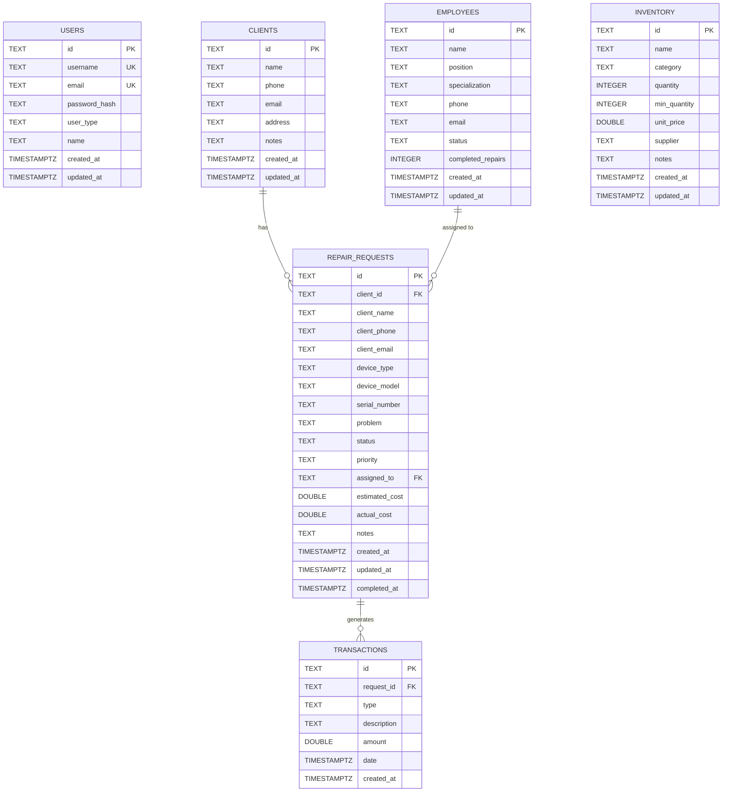

# Диаграммы системы

Ниже собраны базовые диаграммы по текущей реализации проекта `neozon-main`.
Формат: `Mermaid`.

## 1. Диаграмма деятельности

Сценарий: создание новой заявки на ремонт через административную форму.



## 2. Диаграмма последовательности

Сценарий: создание новой заявки на ремонт.



## 3. Диаграмма состояний

Жизненный цикл заявки на ремонт по статусам, которые зафиксированы в БД.



## 4. Архитектура приложения

Высокоуровневая архитектура: SPA-клиент, REST API и БД.



## 5. Диаграмма компонентов

Внутреннее разбиение по основным компонентам и связям.



## 6. Диаграмма развертывания

Локальный сценарий запуска проекта, который сейчас используется в репозитории.

```mermaid
flowchart LR
    Browser[Браузер пользователя]

    subgraph Workstation["Локальная машина разработчика / сервер"]
        VITE[Vite dev server\n127.0.0.1:3000]
        EXPRESS[Express backend\n127.0.0.1:3001]
        SQLITE[(SQLite file\nserver/database/kalakutsky.db)]
        PG[(PostgreSQL)\nопционально]
    end

    Browser -->|HTTP| VITE
    VITE -->|REST API / JSON| EXPRESS
    EXPRESS --> SQLITE
    EXPRESS -. при DB_CLIENT=postgres .-> PG
```

## 7. ER-диаграмма базы данных

Диаграмма построена по `server/src/database/schema.sql`.



## Примечания

- Диаграмма состояний отражает типовой бизнес-сценарий. Технически API обновления заявки допускает более свободные переходы статусов.
- `users` сейчас не связан внешними ключами с остальными сущностями и используется для аутентификации.
- `inventory` в текущей схеме существует отдельно от `repair_requests`, то есть расход запчастей по заявке пока не моделируется отдельной связующей таблицей.
